# Logistic Regression

## Loss and Gradient

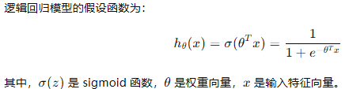

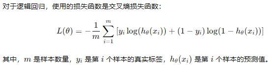

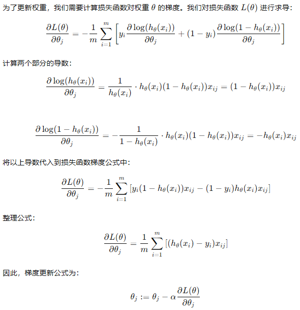

## Code 

```python
"""
references:
https://gitee.com/GZHzzz/statistical-learning-method/blob/master/LogisticRegression/LR.ipynb
https://github.com/caishiqing/manual/blob/master/logistic_regression.py
"""

from math import exp
import numpy as np
import pandas as pd
import matplotlib.pyplot as plt
from sklearn.datasets import load_iris
from sklearn.model_selection import train_test_split

class LogisticReressionClassifier:
    def __init__(self, max_iter=200, learning_rate=0.01):
        self.max_iter = max_iter
        self.learning_rate = learning_rate
  
    def sigmoid(self, x):
        return 1 / (1 + exp(-x))

    def data_matrix(self, X):
        data_mat = []
        for d in X:
            data_mat.append([1.0, *d])
        return data_mat

    def fit(self, X, y):
        # label = np.mat(y)
        data_mat = self.data_matrix(X) # m*n
        self.weights = np.zeros((len(data_mat[0]), 1), dtype=np.float32)
        # self.weights = np.random.random((len(data_mat[0]), 1))

        for iter_ in range(self.max_iter):
            for i in range(len(X)):
                result = self.sigmoid(np.dot(data_mat[i], self.weights))
                error = y[i] - result 
                self.weights += self.learning_rate * error * np.transpose([data_mat[i]])
        print('LogisticRegression Model(learning_rate={},max_iter={})'.format(self.learning_rate, self.max_iter))

    # def f(self, x):
    #     return -(self.weights[0] + self.weights[1] * x) / self.weights[2]

    def score(self, X_test, y_test):
        right = 0
        X_test = self.data_matrix(X_test)
        for x, y in zip(X_test, y_test):
            result = np.dot(x, self.weights)
            if (result > 0 and y == 1) or (result < 0 and y == 0):
                right += 1
        return right / len(X_test)


def create_data():
    iris = load_iris()
    df = pd.DataFrame(iris.data, columns=iris.feature_names)
    df['label'] = iris.target
    df.columns = ['sepal length', 'sepal width', 'petal length', 'petal width', 'label']
    data = np.array(df.iloc[:100, [0,1,-1]])
    # print(data)
    return data[:,:2], data[:,-1]


X, y = create_data()
X_train, X_test, y_train, y_test = train_test_split(X, y, test_size=0.3)

lr_clf = LogisticReressionClassifier()
lr_clf.fit(X_train, y_train)
lr_clf.score(X_test, y_test)

x_ponits = np.arange(4, 8)
y_ = -(lr_clf.weights[1]*x_ponits + lr_clf.weights[0])/lr_clf.weights[2]
plt.plot(x_ponits, y_)

#lr_clf.show_graph()
plt.scatter(X[:50,0],X[:50,1], label='0')
plt.scatter(X[50:,0],X[50:,1], label='1')
plt.legend()
```

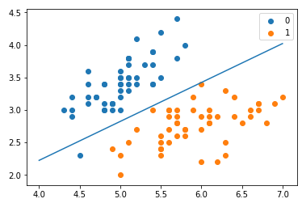


# K-Means

## Normal Usage

```python
import matplotlib.pyplot as plt
from sklearn.datasets import make_blobs  # 导入产生模拟数据的方法
from sklearn.cluster import KMeans
 
 
# 1. 产生模拟数据
k = 5
X, Y = make_blobs(n_samples=1000, n_features=2, centers=k, random_state=1)
 
# 2. 模型构建
km = KMeans(n_clusters=k, init='k-means++', max_iter=30)
km.fit(X)
 
# 获取簇心
centroids = km.cluster_centers_
# 获取归集后的样本所属簇对应值
y_kmean = km.predict(X)
 
# 呈现未归集前的数据
plt.scatter(X[:, 0], X[:, 1], s=50)
plt.yticks(())
plt.show()
 
#归集后的数据集呈现
plt.scatter(X[:, 0], X[:, 1], c=y_kmean, s=50, cmap='viridis')
plt.scatter(centroids[:, 0], centroids[:, 1], c='black', s=100, alpha=0.5)
plt.show()
```

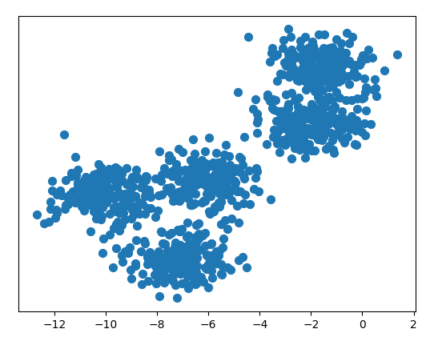

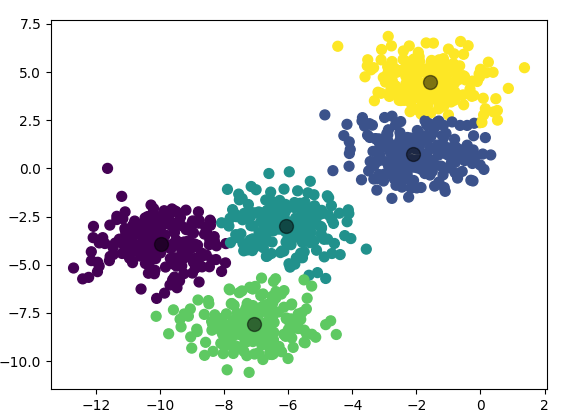

## Code

```python
import collections
import math
import numpy as np

class KMeans:
    def __init__(self, max_iter, k): 
        self.max_iter = max_iter
        self.k = k
        self.class_center = None
        self.sample_calss = None
  
    def get_distance(self, pos1, pos2):
        dis = 0.0
        for i in range(len(pos1)):
            dis += (pos1[i] - pos2[i]) ** 2 
        return math.sqrt(dis) 
  
    def get_new_center(self, pos_list):
        center = [] 
        for feature in range(len(pos_list[0])):
            center_f = 0.0
            for i in range(len(pos_list)):
                center_f += pos_list[i][feature] 
            center.append(center_f / len(pos_list)) 
        return tuple(center) 

    def fit(self, X):
        self.class_center = X[: self.k] 
        self.sample_calss = [None for i in range(len(X))] 
        iter = 0 
  
        while iter < self.max_iter:
            class_cluster = collections.defaultdict(list)
            for i in range(len(X)):
                cur = X[i] 
                min_dis = float('inf') 
                cur_label = -1 
                for label in range(self.k):
                    center = self.class_center[label] 
                    dis = self.get_distance(cur, center) 
                    if dis < min_dis:
                        min_dis = dis 
                        cur_label = label
                class_cluster[cur_label].append(cur) 
                self.sample_calss[i] = cur_label
      
            for label in class_cluster:
                new_center = self.get_new_center(class_cluster[label]) 
                self.class_center[label] = new_center 
      
            iter += 1 
        return self.sample_calss, self.class_center
  
if __name__ == '__main__':
    arr = [ [1.5, 2.1],
            [0.8, 2.1],
            [1.3, 2.1],
            [110.5, 260.6],
            [21.7, 32.8],
            [130.9, 150.8],
            [32.6, 40.7],
            [41.5, 24.7] ]
    X = np.array(arr) 
    k_means = KMeans(100, 3) 
    sample_class, centers = k_means.fit(arr) 
    for cls in sample_class:
        print(cls)
```


# Transformer 

## Architecture

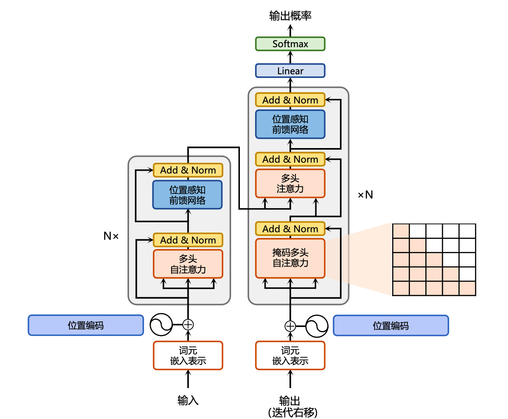

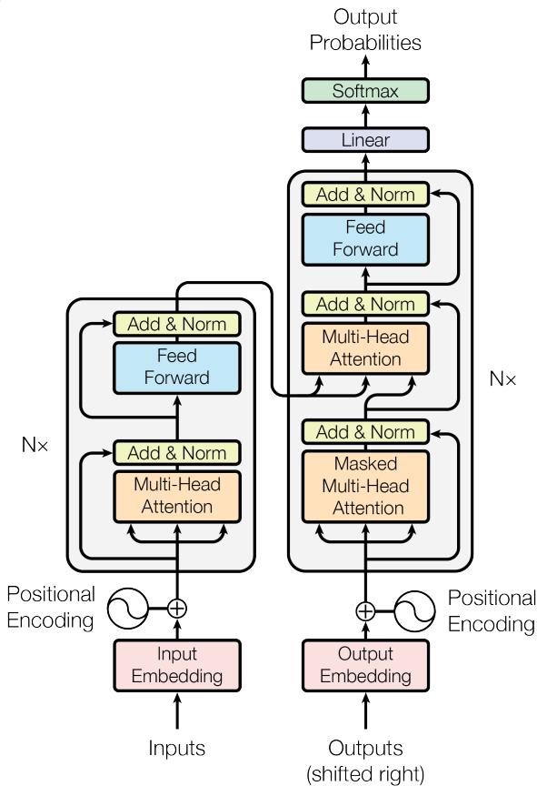

## Code

### 1、Position Embedding

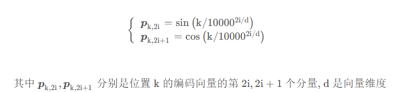

```python
class PositionalEncoding(nn.Module):
    def __init__(self, d_model, dropout=0.1, max_len=5000):
        super(PositionalEncoding,self).__init__()
        self.dropout = nn.Dropout(p=dropout)
        pos_table = np.array([
        [pos / np.power(10000, 2 * i / d_model) for i in range(d_model)]
        if pos != 0 else np.zeros(d_model) for pos in range(max_len)])
        pos_table[1:, 0::2] = np.sin(pos_table[1:, 0::2])                  # 字嵌入维度为偶数时
        pos_table[1:, 1::2] = np.cos(pos_table[1:, 1::2])                  # 字嵌入维度为奇数时
        self.pos_table = torch.FloatTensor(pos_table).cuda()               # pos_table: [max_len, d_model]
  
    def forward(self, enc_inputs):                                         # enc_inputs: [batch_size, seq_len, d_model]
        enc_inputs += self.pos_table[:enc_inputs.size(1), :]
        return self.dropout(enc_inputs.cuda())
```

### 2、Attention Padding Mask

```python
def get_attn_pad_mask(seq_q, seq_k):
    batch_size, len_q = seq_q.size()       # seq_q 用于升维，为了做attention，mask score矩阵用的
    batch_size, len_k = seq_k.size()
    pad_attn_mask = seq_k.data.eq(0).unsqueeze(1)     # 判断 输入那些含有P(=0), 用1标记, [batch_size, 1, len_k]
    return pad_attn_mask.expand(batch_size, len_q, len_k)      # 扩展成多维度   [batch_size, len_q, len_k]
```

### 3、Decoder Mask （Attention Sequence Mask）

```python
def get_attn_subsequence_mask(seq):                               # seq: [batch_size, tgt_len]
    attn_shape = [seq.size(0), seq.size(1), seq.size(1)]          # 生成上三角矩阵, [batch_size, tgt_len, tgt_len]
    subsequence_mask = np.triu(np.ones(attn_shape), k=1)
    subsequence_mask = torch.from_numpy(subsequence_mask).byte()  #  [batch_size, tgt_len, tgt_len]
    return subsequence_mask
```

### 4、ScaledDotProductAttention

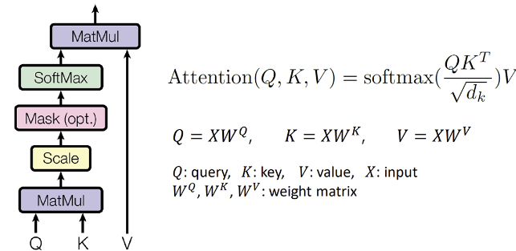

```python
class ScaledDotProductAttention(nn.Module):
    def __init__(self):
        super(ScaledDotProductAttention, self).__init__()

    def forward(self, Q, K, V, attn_mask):                             # Q: [batch_size, n_heads, len_q, d_k]
                                                                       # K: [batch_size, n_heads, len_k, d_k]
                                                                       # V: [batch_size, n_heads, len_v(=len_k), d_v]
                                                                       # attn_mask: [batch_size, n_heads, seq_len, seq_len]
        scores = torch.matmul(Q, K.transpose(-1, -2)) / np.sqrt(d_k)   # scores : [batch_size, n_heads, len_q, len_k]
        scores.masked_fill_(attn_mask, -1e9)                           # 如果是停用词P就等于 0 
        attn = nn.Softmax(dim=-1)(scores)
        context = torch.matmul(attn, V)                                # [batch_size, n_heads, len_q, d_v]
        return context, attn
```

### 5、Multi-Head Attention

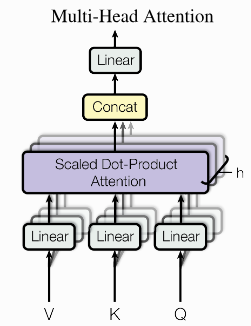

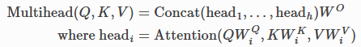

```python
class MultiHeadAttention(nn.Module):
    def __init__(self):
        super(MultiHeadAttention, self).__init__()
        self.W_Q = nn.Linear(d_model, d_k * n_heads, bias=False)
        self.W_K = nn.Linear(d_model, d_k * n_heads, bias=False)
        self.W_V = nn.Linear(d_model, d_v * n_heads, bias=False)
        self.fc = nn.Linear(n_heads * d_v, d_model, bias=False)
  
    def forward(self, input_Q, input_K, input_V, attn_mask):    # input_Q: [batch_size, len_q, d_model]
                                                                # input_K: [batch_size, len_k, d_model]
                                                                # input_V: [batch_size, len_v(=len_k), d_model]
                                                                # attn_mask: [batch_size, seq_len, seq_len]
        residual, batch_size = input_Q, input_Q.size(0)
        Q = self.W_Q(input_Q).view(batch_size, -1, n_heads, d_k).transpose(1,2)  # Q: [batch_size, n_heads, len_q, d_k]
        K = self.W_K(input_K).view(batch_size, -1, n_heads, d_k).transpose(1,2)  # K: [batch_size, n_heads, len_k, d_k]
        V = self.W_V(input_V).view(batch_size, -1, n_heads, d_v).transpose(1,2)  # V: [batch_size, n_heads, len_v(=len_k), d_v]
        attn_mask = attn_mask.unsqueeze(1).repeat(1, n_heads, 1, 1)              # attn_mask : [batch_size, n_heads, seq_len, seq_len]
        context, attn = ScaledDotProductAttention()(Q, K, V, attn_mask)          # context: [batch_size, n_heads, len_q, d_v]
                                                                                 # attn: [batch_size, n_heads, len_q, len_k]
        context = context.transpose(1, 2).reshape(batch_size, -1, n_heads * d_v) # context: [batch_size, len_q, n_heads * d_v]
        output = self.fc(context)                                                # [batch_size, len_q, d_model]
        return nn.LayerNorm(d_model).cuda()(output + residual), attn
```

### 6、PoswiseFeedForwardNet

```python
class PoswiseFeedForwardNet(nn.Module):
    def __init__(self):
        super(PoswiseFeedForwardNet, self).__init__()
        self.fc = nn.Sequential(
            nn.Linear(d_model, d_ff, bias=False),
            nn.ReLU(),
            nn.Linear(d_ff, d_model, bias=False))
  
    def forward(self, inputs):                             # inputs: [batch_size, seq_len, d_model]
        residual = inputs
        output = self.fc(inputs)
        return nn.LayerNorm(d_model).cuda()(output + residual)   # [batch_size, seq_len, d_model]  
```

### 7、Encoder Layer（Block）

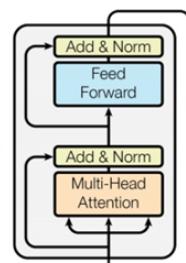

```python
class EncoderLayer(nn.Module):
    def __init__(self):
        super(EncoderLayer, self).__init__()
        self.enc_self_attn = MultiHeadAttention()                                     # 多头注意力机制
        self.pos_ffn = PoswiseFeedForwardNet()                                        # 前馈神经网络

    def forward(self, enc_inputs, enc_self_attn_mask):                                # enc_inputs: [batch_size, src_len, d_model]
        # 输入3个enc_inputs分别与W_q、W_k、W_v相乘得到Q、K、V                           # enc_self_attn_mask: [batch_size, src_len, src_len]
        enc_outputs, attn = self.enc_self_attn(enc_inputs, enc_inputs, enc_inputs,    # enc_outputs: [batch_size, src_len, d_model], 
                                               enc_self_attn_mask)                    # attn: [batch_size, n_heads, src_len, src_len]   
        enc_outputs = self.pos_ffn(enc_outputs)                                       # enc_outputs: [batch_size, src_len, d_model]
        return enc_outputs, attn
```

### 8、Encoder

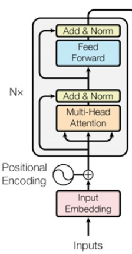

```python
class Encoder(nn.Module):
    def __init__(self):
        super(Encoder, self).__init__()
        self.src_emb = nn.Embedding(src_vocab_size, d_model)
        self.pos_emb = PositionalEncoding(d_model)
        self.layers = nn.ModuleList([EncoderLayer() for _ in range(n_layers)])

    def forward(self, enc_inputs):
        '''
        enc_inputs: [batch_size, src_len]
        '''
        enc_outputs = self.src_emb(enc_inputs)                                      # [batch_size, src_len, d_model]
        enc_outputs = self.pos_emb(enc_outputs.transpose(0, 1)).transpose(0, 1)     # [batch_size, src_len, d_model]
        enc_self_attn_mask = get_attn_pad_mask(enc_inputs, enc_inputs)              # [batch_size, src_len, src_len]
        enc_self_attns = []
        for layer in self.layers:
            # enc_outputs: [batch_size, src_len, d_model], enc_self_attn: [batch_size, n_heads, src_len, src_len]
            enc_outputs, enc_self_attn = layer(enc_outputs, enc_self_attn_mask)
            enc_self_attns.append(enc_self_attn)
        return enc_outputs, enc_self_attns
```

### 9、Decoder Layer（Block）

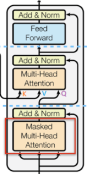

```python
class DecoderLayer(nn.Module):
    def __init__(self):
        super(DecoderLayer, self).__init__()
        self.dec_self_attn = MultiHeadAttention()
        self.dec_enc_attn = MultiHeadAttention()
        self.pos_ffn = PoswiseFeedForwardNet()

    def forward(self, dec_inputs, enc_outputs, dec_self_attn_mask, dec_enc_attn_mask): # dec_inputs: [batch_size, tgt_len, d_model]
                                                                                       # enc_outputs: [batch_size, src_len, d_model]
                                                                                       # dec_self_attn_mask: [batch_size, tgt_len, tgt_len]
                                                                                       # dec_enc_attn_mask: [batch_size, tgt_len, src_len]
        dec_outputs, dec_self_attn = self.dec_self_attn(dec_inputs, dec_inputs, 
                                                 dec_inputs, dec_self_attn_mask)       # dec_outputs: [batch_size, tgt_len, d_model]
                                                                                       # dec_self_attn: [batch_size, n_heads, tgt_len, tgt_len]
        dec_outputs, dec_enc_attn = self.dec_enc_attn(dec_outputs, enc_outputs, 
                                                enc_outputs, dec_enc_attn_mask)        # dec_outputs: [batch_size, tgt_len, d_model]
                                                                                       # dec_enc_attn: [batch_size, h_heads, tgt_len, src_len]
        dec_outputs = self.pos_ffn(dec_outputs)                                        # dec_outputs: [batch_size, tgt_len, d_model]
        return dec_outputs, dec_self_attn, dec_enc_attn
```

### 10、Decoder

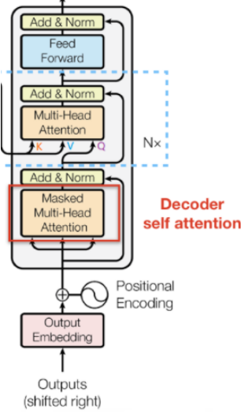

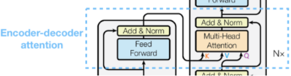

```python
class Decoder(nn.Module):
    def __init__(self):
        super(Decoder, self).__init__()
        self.tgt_emb = nn.Embedding(tgt_vocab_size, d_model)
        self.pos_emb = PositionalEncoding(d_model)
        self.layers = nn.ModuleList([DecoderLayer() for _ in range(n_layers)])

    def forward(self, dec_inputs, enc_inputs, enc_outputs):
        '''
        dec_inputs: [batch_size, tgt_len]
        enc_intpus: [batch_size, src_len]
        enc_outputs: [batch_size, src_len, d_model]
        '''
        dec_outputs = self.tgt_emb(dec_inputs) # [batch_size, tgt_len, d_model]
        dec_outputs = self.pos_emb(dec_outputs.transpose(0, 1)).transpose(0, 1).cuda() # [batch_size, tgt_len, d_model]
        # Decoder输入序列的pad mask矩阵（这个例子中decoder是没有加pad的，实际应用中都是有pad填充的）
        dec_self_attn_pad_mask = get_attn_pad_mask(dec_inputs, dec_inputs).cuda() # [batch_size, tgt_len, tgt_len]
        # Masked Self_Attention：当前时刻是看不到未来的信息的
        dec_self_attn_subsequence_mask = get_attn_subsequence_mask(dec_inputs).cuda() # [batch_size, tgt_len, tgt_len]
        # Decoder中把两种mask矩阵相加（既屏蔽了pad的信息，也屏蔽了未来时刻的信息）
        dec_self_attn_mask = torch.gt((dec_self_attn_pad_mask + dec_self_attn_subsequence_mask), 0).cuda() # [batch_size, tgt_len, tgt_len]

        # 这个mask主要用于encoder-decoder attention层
        # get_attn_pad_mask主要是enc_inputs的pad mask矩阵(因为enc是处理K,V的，求Attention时是用v1,v2,..vm去加权的，
        # 要把pad对应的v_i的相关系数设为0，这样注意力就不会关注pad向量)
        #                       dec_inputs只是提供expand的size的
        dec_enc_attn_mask = get_attn_pad_mask(dec_inputs, enc_inputs) # [batc_size, tgt_len, src_len]

        dec_self_attns, dec_enc_attns = [], []
        for layer in self.layers:
  # dec_outputs: [batch_size, tgt_len, d_model], dec_self_attn: [batch_size, n_heads, tgt_len, tgt_len], dec_enc_attn: [batch_size, h_heads, tgt_len, src_len]
            dec_outputs, dec_self_attn, dec_enc_attn = layer(dec_outputs, enc_outputs, dec_self_attn_mask, dec_enc_attn_mask)
            dec_self_attns.append(dec_self_attn)
            dec_enc_attns.append(dec_enc_attn)
        return dec_outputs, dec_self_attns, dec_enc_attns
```

### 11、Transformer

```python
class Transformer(nn.Module):
    def __init__(self):
        super(Transformer, self).__init__()
        self.Encoder = Encoder().cuda()
        self.Decoder = Decoder().cuda()
        self.projection = nn.Linear(d_model, tgt_vocab_size, bias=False).cuda()
    def forward(self, enc_inputs, dec_inputs):                         # enc_inputs: [batch_size, src_len]  
                                                                       # dec_inputs: [batch_size, tgt_len]
        enc_outputs, enc_self_attns = self.Encoder(enc_inputs)         # enc_outputs: [batch_size, src_len, d_model], 
                                                                       # enc_self_attns: [n_layers, batch_size, n_heads, src_len, src_len]
        dec_outputs, dec_self_attns, dec_enc_attns = self.Decoder(
            dec_inputs, enc_inputs, enc_outputs)                       # dec_outpus    : [batch_size, tgt_len, d_model], 
                                                                       # dec_self_attns: [n_layers, batch_size, n_heads, tgt_len, tgt_len], 
                                                                       # dec_enc_attn  : [n_layers, batch_size, tgt_len, src_len]
        dec_logits = self.projection(dec_outputs)                      # dec_logits: [batch_size, tgt_len, tgt_vocab_size]
        return dec_logits.view(-1, dec_logits.size(-1)), enc_self_attns, dec_self_attns, dec_enc_attns
```

### 12、Train

```python
model = Transformer().cuda()
criterion = nn.CrossEntropyLoss(ignore_index=0)     #忽略 占位符 索引为0.
optimizer = optim.SGD(model.parameters(), lr=1e-3, momentum=0.99)

for epoch in range(1000):
    for enc_inputs, dec_inputs, dec_outputs in loader:
        enc_inputs, dec_inputs, dec_outputs = enc_inputs.cuda(), dec_inputs.cuda(), dec_outputs.cuda()
        outputs, enc_self_attns, dec_self_attns, dec_enc_attns = model(enc_inputs, dec_inputs)
  
        loss = criterion(outputs,dec_outputs.view(-1))
        print('Epoch:', '%04d' % (epoch+1), 'loss =', '{:.6f}'.format(loss))
        optimizer.zero_grad()
        loss.backward()
        optimizer.step()
```

### 13、Test

```python
def test(model, enc_input, start_symbol):
    enc_outputs, enc_self_attns = model.Encoder(enc_input)
    dec_input = torch.zeros(1, tgt_len).type_as(enc_input.data)
    next_symbol = start_symbol
    for i in range(0, tgt_len):
        dec_input[0][i] = next_symbol
        dec_outputs, _, _ = model.Decoder(dec_input, enc_input, enc_outputs)
        projected = model.projection(dec_outputs)
        prob = projected.squeeze(0).max(dim=-1, keepdim=False)[1]
        next_word = prob.data[i]
        next_symbol = next_word.item()
    return dec_input
enc_inputs, _, _ = next(iter(loader))
predict_dec_input = test(model, enc_inputs[1].view(1, -1).cuda(), start_symbol=tgt_vocab["S"])
predict, _, _, _ = model(enc_inputs[1].view(1, -1).cuda(), predict_dec_input)
predict = predict.data.max(1, keepdim=True)[1]
print([src_idx2word[int(i)] for i in enc_inputs[1]], '->', 
[idx2word[n.item()] for n in predict.squeeze()])
```
